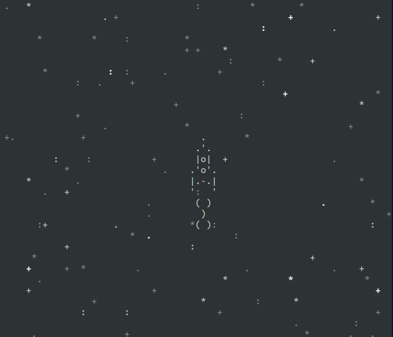

# Проект игры про космос



Проект игры про космос запускаемый в консоли

## Как установить

Python3 должен быть установлен.

Скачайте код:
```python
git clone https://github.com/Dmitriy877/outer_space_game.git
```

Перейдите в каталог проекта:
```python
cd ./outer_space_game
```

В каталоге проекта создайте виртуальное окружение:
```python
python -m venv venv
```

Активируйте его. На разных операционных системах это делается разными командами:

* Windows: `.\venv\Scripts\activate`
* MacOS/Linux: `source venv/bin/activate`


Установите зависимости в виртуальное окружение:

 "pip" (или "pip3", есть конфлик с python2) для установки зависимостей:
```python
pip install -r requerements.txt
```

## Как запустить

Работоспособность проверена в консоли [Warp Terminal](https://www.warp.dev)

!!! Не корректно работает в консоли VsCode

Например:

* Откройте консоль
* Перейдите в консоли в папку с скриптом , например:

```bash
cd ./Documents/GitHub/repository_name
```

* введите в консоль команду запуска скрипта:

```python
python outer_space_game.py
```
или 

```python
python3 outer_space_game.py
```

* Игра начнет свою работу

Управление осуществляется клавишами стрелок на клавиатуре

### Цель проекта

Код написан в образовательных целях на онлайн-курсе для веб-разработчиков [dvmn.org](https://dvmn.org/)

